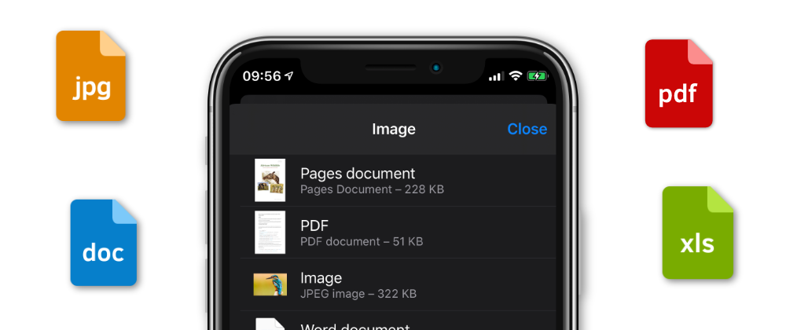
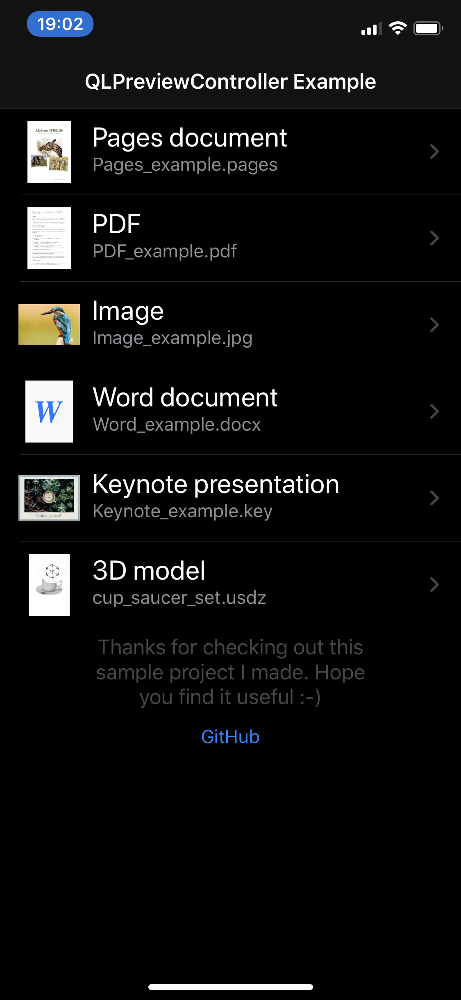
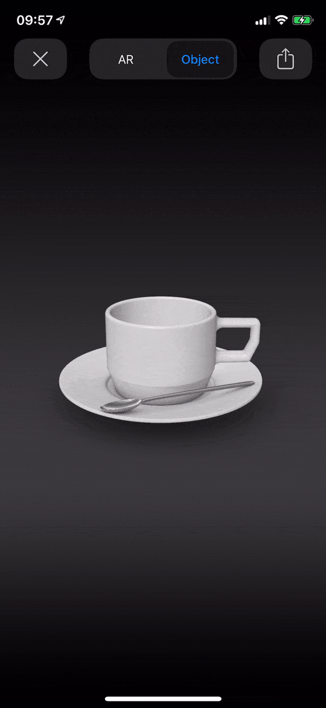

  <a href="https://github.com/nemecek-filip/DynamicType-ReferenceApp">Dynamic Type</a> &bull;
  <a href="https://github.com/nemecek-filip/EKEventKit.Example">Event Kit</a> &bull;
  <b>Quick Look</b> 	&bull;
  <a href="https://github.com/nemecek-filip/App-ideas">App Ideas</a> &bull;
  <a href="https://github.com/nemecek-filip/KeyboardPreview.iOS">Keyboard Preview</a> &bull;
  <a href="https://github.com/nemecek-filip/CompositionalDiffablePlayground.ios">Modern Collection Views</a>

----
# QLPreviewController Example

### Simple example project showing `QLPreviewController` usage

This projects shows how to use `QLPreviewController` to preview various files like PDF, image, Word document and more. It shows how to create custom `QLPreviewItem`, how to configure `QLPreviewController` to display multiple files and also how to generate thumbnails with `QLThumbnailGenerator` using the `QLThumbnailGenerator.Request` and method `generateBestRepresentation`.

It can even display 3D ARKit models in the `.usdz`

